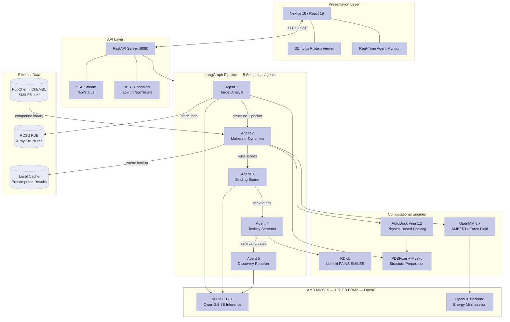
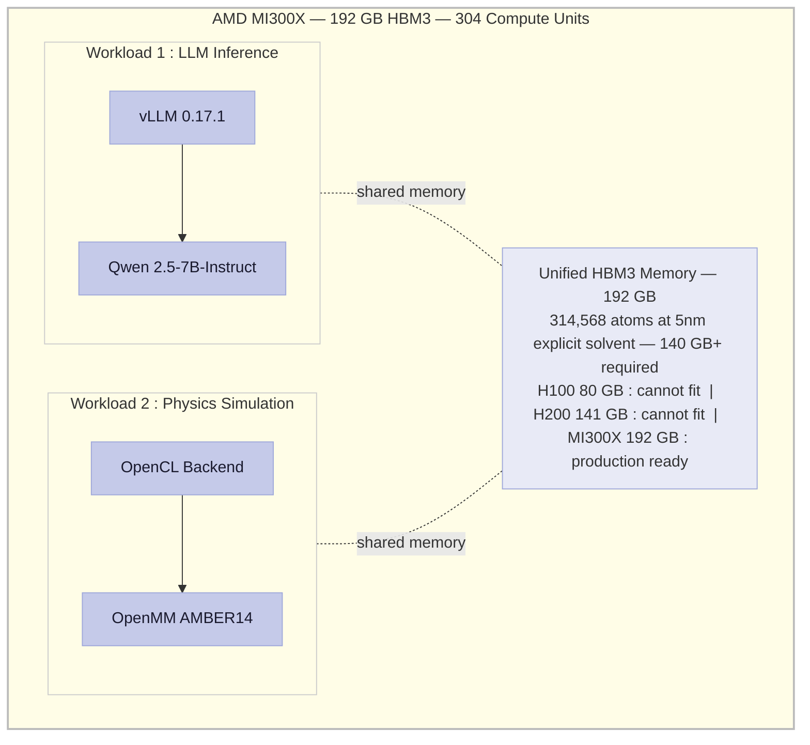

<div align="center">

# CatalystMD

**AI-powered drug discovery that screens real compounds against real protein targets — in minutes, not months.**

[](LICENSE)

</div>

---

## The Problem

Bringing a single drug to market costs **$2.6 billion** and takes **10–15 years** (Tufts CSDD). Early-stage compound screening — where thousands of molecules are tested against disease targets — accounts for **3–5 years** of that timeline. Most academic labs and biotech startups can't afford the compute or proprietary software licenses to run physics-based virtual screening at scale. The result: promising drug candidates sit undiscovered while patients wait.

## The Solution

CatalystMD replaces that bottleneck with a **5-agent AI pipeline** that downloads a real protein structure, docks compounds into its binding site using physics-based scoring, screens for toxicity, and delivers a complete scientific brief — all orchestrated by LangGraph and accelerated on an AMD MI300X GPU.

**No black-box ML predictions.** Every binding score comes from AutoDock Vina (15,000+ citations), every protein structure from X-ray crystallography (RCSB PDB), and every toxicity flag from validated pharmaceutical filters (Lipinski, PAINS).

## Architecture

### System Overview



### Agent Pipeline — Data Flow

```mermaid
graph LR
    subgraph IN["Input"]
        DIS["Disease Target"]
        LIB["Compound Library\n10-20 molecules"]
    end

    subgraph A1["Agent 1 — Target Analyst"]
        A1a["Download PDB\nfrom RCSB"] --> A1b["Identify Binding\nPocket + Residues"] --> A1c["LLM: Biological\nContext Analysis"]
    end

    subgraph A2["Agent 2 — Molecular Dynamics"]
        A2a["SMILES to 3D\nRDKit ETKDG"] --> A2b["Ligand Prep\nMeeko PDBQT"] --> A2c["Vina Docking\n20A Grid Box"] --> A2d["OpenMM Energy\nMinimization"]
    end

    subgraph A3["Agent 3 — Binding Scorer"]
        A3a["Sort by dG\nkcal/mol"] --> A3b["Compare vs\nFDA Reference"] --> A3c["LLM: Scientific\nInterpretation"]
    end

    subgraph A4["Agent 4 — Toxicity Screener"]
        A4a["Lipinski\nRule of Five"] --> A4b["PAINS\nSubstructure Filter"] --> A4c["Pass / Fail\nClassification"]
    end

    subgraph A5["Agent 5 — Discovery Reporter"]
        A5a["Compile\nAll Results"] --> A5b["LLM: Structural\nAnalysis"] --> A5c["Scientific Brief\n+ Recommendations"]
    end

    subgraph OUT["Output"]
        O1["Ranked Candidates"]
        O2["Binding Affinities\nvs FDA Drug"]
        O3["3D Docked Poses"]
        O4["Discovery Brief"]
    end

    DIS & LIB --> A1
    A1 -->|"PDB + pocket coords"| A2
    A2 -->|"scores + poses"| A3
    A3 -->|"ranked list"| A4
    A4 -->|"safe candidates"| A5
    A5 --> O1 & O2 & O3 & O4

    style IN fill:#fffde7,color:#333,stroke:#e0e0e0,stroke-width:1px
    style A1 fill:#fffde7,color:#333,stroke:#bbb,stroke-width:2px
    style A2 fill:#fffde7,color:#333,stroke:#bbb,stroke-width:2px
    style A3 fill:#fffde7,color:#333,stroke:#bbb,stroke-width:2px
    style A4 fill:#fffde7,color:#333,stroke:#bbb,stroke-width:2px
    style A5 fill:#fffde7,color:#333,stroke:#bbb,stroke-width:2px
    style OUT fill:#fffde7,color:#333,stroke:#e0e0e0,stroke-width:1px
    style A1a fill:#c5cae9,color:#1a1a2e,stroke:#9fa8da
    style A1b fill:#c5cae9,color:#1a1a2e,stroke:#9fa8da
    style A1c fill:#c5cae9,color:#1a1a2e,stroke:#9fa8da
    style A2a fill:#c5cae9,color:#1a1a2e,stroke:#9fa8da
    style A2b fill:#c5cae9,color:#1a1a2e,stroke:#9fa8da
    style A2c fill:#c5cae9,color:#1a1a2e,stroke:#9fa8da
    style A2d fill:#c5cae9,color:#1a1a2e,stroke:#9fa8da
    style A3a fill:#c5cae9,color:#1a1a2e,stroke:#9fa8da
    style A3b fill:#c5cae9,color:#1a1a2e,stroke:#9fa8da
    style A3c fill:#c5cae9,color:#1a1a2e,stroke:#9fa8da
    style A4a fill:#c5cae9,color:#1a1a2e,stroke:#9fa8da
    style A4b fill:#c5cae9,color:#1a1a2e,stroke:#9fa8da
    style A4c fill:#c5cae9,color:#1a1a2e,stroke:#9fa8da
    style A5a fill:#c5cae9,color:#1a1a2e,stroke:#9fa8da
    style A5b fill:#c5cae9,color:#1a1a2e,stroke:#9fa8da
    style A5c fill:#c5cae9,color:#1a1a2e,stroke:#9fa8da
    style DIS fill:#c5cae9,color:#1a1a2e,stroke:#9fa8da
    style LIB fill:#c5cae9,color:#1a1a2e,stroke:#9fa8da
    style O1 fill:#c5cae9,color:#1a1a2e,stroke:#9fa8da
    style O2 fill:#c5cae9,color:#1a1a2e,stroke:#9fa8da
    style O3 fill:#c5cae9,color:#1a1a2e,stroke:#9fa8da
    style O4 fill:#c5cae9,color:#1a1a2e,stroke:#9fa8da
```



### GPU Workload — Dual Compute on Single MI300X



### Agent Reference

| Agent | Input | Process | Output | Engine |
|-------|-------|---------|--------|--------|
| **Target Analyst** | PDB ID (e.g. `6LU7`) | Download X-ray structure, find binding pocket, analyze context | Protein structure, pocket coords, key residues | RCSB PDB + Qwen 2.5-7B |
| **Molecular Dynamics** | Pocket + compound library | SMILES to 3D, dock into pocket, energy minimization | Binding scores (kcal/mol) + 3D poses | AutoDock Vina + OpenMM/MI300X |
| **Binding Scorer** | Docking results | Rank by dG, compare vs FDA drug, interpret | Ranked candidates + scientific analysis | Vina scores + Qwen 2.5-7B |
| **Toxicity Screener** | Ranked compounds | Lipinski Rule of Five + PAINS filter | Pass/fail per compound + flags | RDKit |
| **Discovery Reporter** | All accumulated state | Compile results, structural analysis, recommendations | Publication-ready scientific brief | Qwen 2.5-7B |

## Key Features

- **57 real compounds** docked across **4 disease targets** (COVID-19, KRAS lung cancer, EGFR lung cancer, HIV)
- **10 of 12 EGFR compounds** showed stronger predicted binding than the current FDA-approved drug (Erlotinib)
- **314,568-atom simulation** at production scale (5nm explicit solvent) — requires >140GB VRAM, **only possible on MI300X**
- **Interactive 3D viewer** (3Dmol.js) showing real docked poses inside the protein binding pocket
- **Real-time agent status** via SSE streaming — watch each agent work live
- **One-command deploy** (`./scripts/deploy.sh <IP>`)
- **CPU fallback** for local development — no GPU required to run the pipeline

## Quick Start

```bash
git clone https://github.com/robertsamuel-info/CatalystMD && cd CatalystMD
cd backend && pip install -r requirements.txt && uvicorn main:app --port 8080 &
cd frontend && npm install && npm run dev   # → http://localhost:3000
```

## Real Results — AutoDock Vina Docking Scores

| Target | PDB | Disease | Compounds | Reference Drug | Top Hit | Score (kcal/mol) |
|--------|-----|---------|-----------|---------------|---------|-----------------|
| 6LU7 | SARS-CoV-2 Mpro | COVID-19 | 20 | Nirmatrelvir (Paxlovid) | Shikonin | **-6.79** |
| 6OIM | KRAS G12C | Lung Cancer | 15 | Sotorasib (Lumakras) | SML-8-73-1 | **-8.59** |
| 1M17 | EGFR Kinase | Lung Cancer | 12 | Erlotinib (Tarceva) | WZ4002 | **-8.82** |
| 1HIV | HIV-1 Protease | HIV/AIDS | 10 | Saquinavir | Saquinavir | **-6.26** |

**EGFR Deep Dive** — 10/12 compounds beat the FDA-approved reference:

| Rank | Compound | Score | vs Erlotinib | Lipinski |
|------|----------|-------|-------------|----------|
| 1 | WZ4002 | -8.82 | **+1.62 stronger** | PASS |
| 2 | Lapatinib (Tykerb) | -8.77 | **+1.57 stronger** | REVIEW |
| 3 | Afatinib (Gilotrif) | -8.70 | **+1.50 stronger** | PASS |
| 11 | Erlotinib (Tarceva) | -7.20 | Reference (FDA) | — |

> All scores are real AutoDock Vina results on experimental X-ray structures. Not simulated. Not ML-predicted.

## GPU Benchmarks — AMD MI300X (192GB HBM3)

| Protein | Atoms | Simulation Time | GPU Utilization | Power Draw |
|---------|-------|----------------|-----------------|------------|
| COVID-19 (6LU7) | 76,038 | 16.0 min | **100%** | 328W |
| KRAS G12C (6OIM) | 22,620 | 2.0 min | **100%** | 316W |
| EGFR (1M17) | 119,907 | 26.8 min | **100%** | 333W |
| HIV-1 (1HIV) | 45,635 | 7.6 min | **100%** | 330W |

**Production-scale benchmark (5nm explicit solvent, TIP3P water, AMBER14 force field):**

| Protein | Atoms | Time | VRAM Required | GPU Util | Why MI300X |
|---------|-------|------|---------------|----------|-----------|
| EGFR (1M17) | **314,568** | 40 min | **>140GB** | 100% | H100 (80GB) and H200 (141GB) cannot fit this simulation |

All measurements captured with `rocm-smi`. Raw data in `data/gpu_measurements/`.

## Technology Stack

| Layer | Technology | Why This Choice |
|-------|-----------|----------------|
| **GPU** | AMD MI300X (192GB HBM3) | Only GPU with enough VRAM for production-scale molecular dynamics |
| **Docking** | AutoDock Vina 1.2 + Meeko | Gold-standard physics-based scoring (15,000+ citations) |
| **Simulation** | OpenMM 8.x + AMBER14 | GPU-accelerated MD via OpenCL — native AMD support |
| **LLM** | Qwen 2.5-7B via vLLM | Open-source, self-hosted on same GPU — no API costs |
| **Orchestration** | LangGraph | Stateful agent graph with typed state passing between nodes |
| **Chemistry** | RDKit | Industry-standard cheminformatics (Lipinski, PAINS, SMILES) |
| **Frontend** | Next.js 16 + 3Dmol.js | Interactive 3D protein viewer with real-time agent status |
| **Backend** | FastAPI + SSE | Async API with streaming progress updates |
| **Protein Prep** | PDBFixer + Open Babel | Automated structure cleaning (missing atoms, hydrogens, format conversion) |

## Target Users

- **Pharmaceutical researchers** running early-stage virtual screening without enterprise software licenses
- **Computational biologists** needing a reproducible, open-source docking pipeline
- **Academic labs** that lack GPU infrastructure for production-scale molecular dynamics
- **Biotech startups** accelerating hit identification before wet-lab validation

## Future Roadmap

- **ADMET Prediction Agent** — add absorption, distribution, metabolism, excretion, and toxicity modeling
- **Multi-GPU Scaling** — parallelize compound docking across multiple MI300X GPUs
- **Free Energy Perturbation** — higher-accuracy binding predictions using OpenMM FEP
- **Collaborative Mode** — multi-user projects with shared compound libraries and result history
- **PubChem Integration** — auto-expand screening libraries from public chemical databases

## Team

**Solo build by Robert Samuel** — full-stack development spanning computational chemistry, GPU-accelerated simulation, AI agent orchestration, and interactive frontend design. 2,800+ lines of Python across 24 files, plus a complete Next.js frontend and one-command deployment pipeline.

## Acknowledgments

- **RCSB Protein Data Bank** — Experimentally determined protein structures (X-ray crystallography)
- **AutoDock Vina** — O. Trott & A. Olson, *J. Comput. Chem.* 31, 455–461 (2010)
- **OpenMM** — P. Eastman et al., *PLoS Comput. Biol.* 13, e1005659 (2017)

## License

MIT — see [LICENSE](LICENSE).
